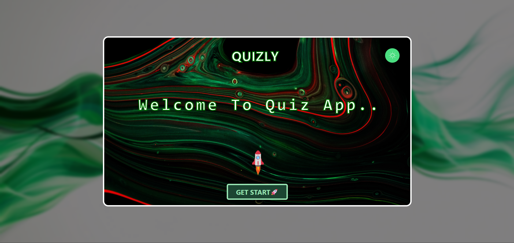
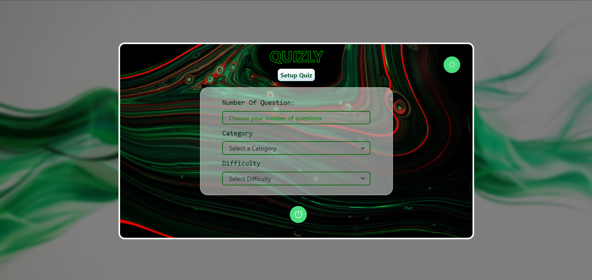
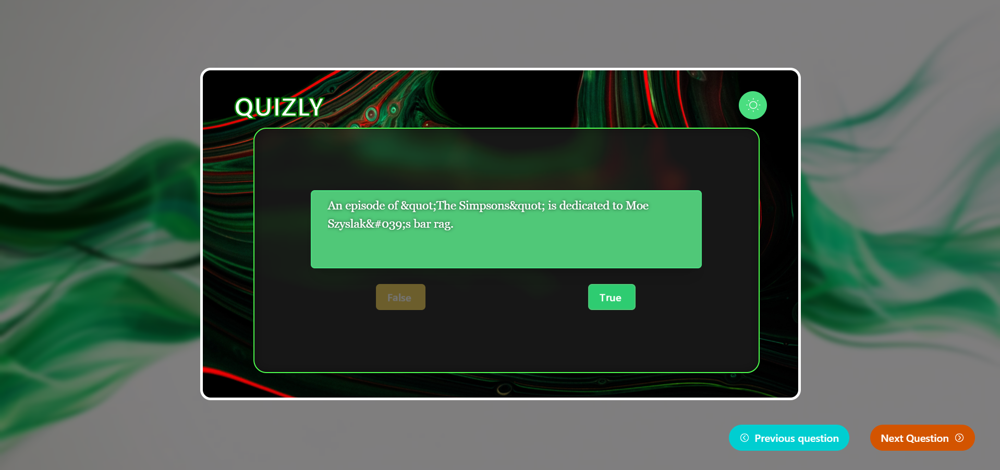
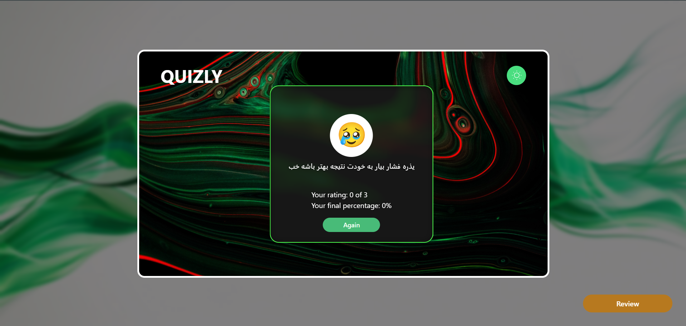

#🧠 React-QuizApp
React-QuizApp is an interactive quiz application built with Next.js and TypeScript. It allows users to answer multiple-choice questions, track their score, and get instant feedback. The project is designed with scalability, clean UI, and smooth user experience in mind.

---

## 🚀 Getting Started

To run this project locally, follow these steps:

### 1. Clone the Repository

```bash
git clone https://github.com/MelikaKhalili/Next-Safarika.git
cd Next-Safarika
```

### 2. Install Dependencies

Use your preferred package manager:

```bash
npm install
# or
yarn install
# or
pnpm install
# or
bun install
```

### 3. Start the Development Server

```bash
npm run dev
# or
yarn dev
# or
pnpm dev
# or
bun dev
```

Open [http://localhost:3000](http://localhost:3000) in your browser to see the result.

---

## 🛠️ Built With

- **React** – JavaScript library for building user interfaces
- **TypeScript** – A superset of JavaScript that adds static typing
- **Tailwind CSS** – Utility-first CSS framework for rapid UI development
- **React Toastify** – For showing elegant toast notifications

---

## 🖼️ ScreeenShot






## 📜 License

This project is licensed under the [MIT License](./LICENSE).

---

## 🤝 Contributing

Contributions are welcome! Here's how you can help:

1. Fork the repository
2. Create a feature or fix branch
3. Make your changes
4. Submit a pull request

---

## 🙋‍♀️ Author

**Melika Khalili**  
GitHub: [@MelikaKhalili](https://github.com/MelikaKhalili)

---

## 🌟 Show Your Support

If you like this project, give it a ⭐️ on GitHub – it really helps!
